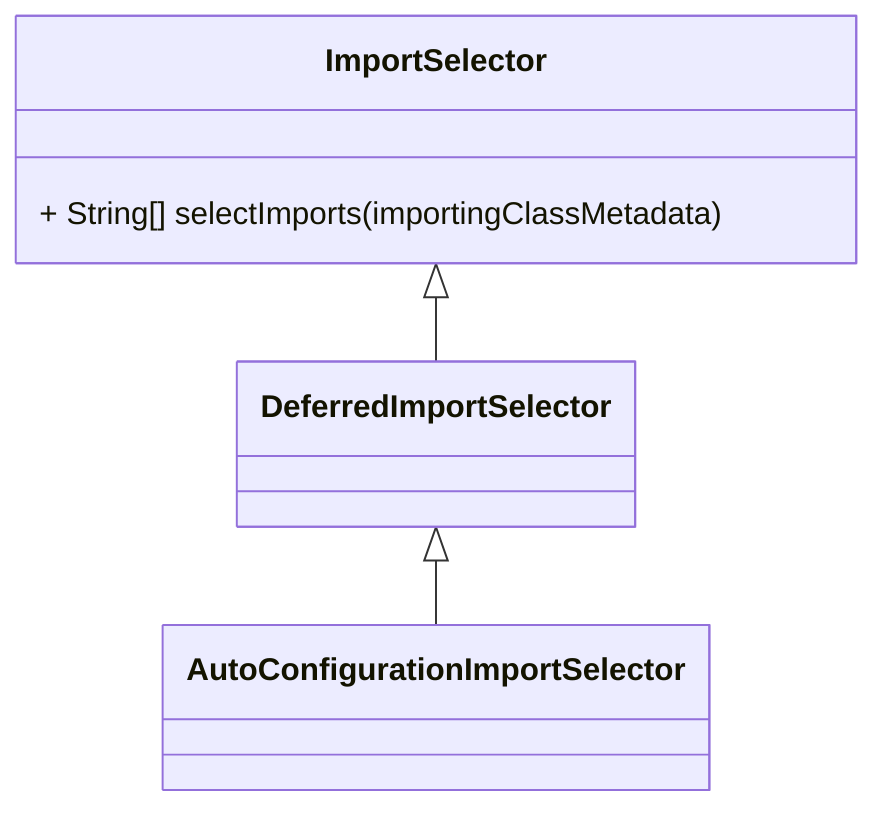

# EnableAutoConfiguration

## What

`@EnableAutoConfiguration`是Spring Boot自动装配的入口，用于加载配置文件`META-INF/spring.factories`中`org.springframework.boot.autoconfigure.EnableAutoConfiguration`指定的且未被`exclude()`和`excludeName()`所排除的配置类，以实现Spring Boot 的自动装配功能。

## How

了解了自动装配的功能，那么其是如何实现的呢？

首先，查看`@EnableAutoConfiguration`注解的源码，发现其类上声明了一个`@Import`注解标记，且这个票房指定了一个配置类`AutoConfigurationImportSelector`。

```java
package org.springframework.boot.autoconfigure;

@Import(AutoConfigurationImportSelector.class)
public @interface EnableAutoConfiguration {
}
```

接着想看`AutoConfigurationImportSelector`的源码，发现其实现了`ImportSelector`接口。



这时，我们可以知道这个配置类会在容器加载或刷新时被解析并回调`selectImports()`方法。

那么现在就来看看`AutoConfigurationImportSelector`是如何实现`selectImports()`方法的吧：

```java
	@Override
	public String[] selectImports(AnnotationMetadata annotationMetadata) {
		if (!isEnabled(annotationMetadata)) {
			return NO_IMPORTS;
		}
		AutoConfigurationEntry autoConfigurationEntry = getAutoConfigurationEntry(annotationMetadata);
		return StringUtils.toStringArray(autoConfigurationEntry.getConfigurations());
	}
```

在上述方法中，`getAutoConfigurationEntry()`方法创建`AutoConfigurationEntry`，并将其`configurations`的值返回，`AutoConfigurationEntry`的定义如下：

```java
protected static class AutoConfigurationEntry {

	private final List<String> configurations;

	private final Set<String> exclusions;

}
```

现在，再来看下`getAutoConfigurationEntry()`方法的定义吧：

```java
 protected AutoConfigurationEntry getAutoConfigurationEntry(AnnotationMetadata annotationMetadata) {
	if (!isEnabled(annotationMetadata)) {
		return EMPTY_ENTRY;
	}
	AnnotationAttributes attributes = getAttributes(annotationMetadata);
    // 获取所有的候选配置
	List<String> configurations = getCandidateConfigurations(annotationMetadata, attributes);
	// 移除重复的配置
    configurations = removeDuplicates(configurations);
	Set<String> exclusions = getExclusions(annotationMetadata, attributes);
	checkExcludedClasses(configurations, exclusions);
	configurations.removeAll(exclusions);
	configurations = getConfigurationClassFilter().filter(configurations);
	// 触发自动配置导入事件
    fireAutoConfigurationImportEvents(configurations, exclusions);
	return new AutoConfigurationEntry(configurations, exclusions);
}
```


<iframe id="embed_dom" name="embed_dom" frameborder="0" style="display:block;width:100%; height:500px;" src="https://www.processon.
com/embed/603c79915653bb36bbe62596"></iframe>


