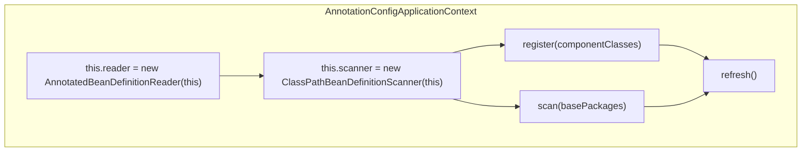

# AnnotationConfigApplicationContext


## What

`AnnotationConfigApplicationContext`


## How

通过查看`AnnotationConfigApplicationContext`的源码，发现其有以下几点：

* 实例化一个`AnnotatedBeanDefinitionReader`

```java
this.reader=new AnnotatedBeanDefinitionReader(this);
```

* 实例化一个`ClassPathBeanDefinitionScanner`

```java
this.scanner=new ClassPathBeanDefinitionScanner(this);
```

* 注册组件类`register(componentClasses)`或扫描包`scan(basePackages)`

* 调用`refresh()`方法。

**上述流程图如下：**



**核心源码如下：**

```java
package org.springframework.context.annotation;

public class AnnotationConfigApplicationContext extends GenericApplicationContext implements AnnotationConfigRegistry {

    private final AnnotatedBeanDefinitionReader reader;

    private final ClassPathBeanDefinitionScanner scanner;

    public AnnotationConfigApplicationContext() {
        this.reader = new AnnotatedBeanDefinitionReader(this);
        this.scanner = new ClassPathBeanDefinitionScanner(this);
    }

    public AnnotationConfigApplicationContext(DefaultListableBeanFactory beanFactory) {
        super(beanFactory);
        this.reader = new AnnotatedBeanDefinitionReader(this);
        this.scanner = new ClassPathBeanDefinitionScanner(this);
    }

    public AnnotationConfigApplicationContext(Class<?>... componentClasses) {
        this();
        register(componentClasses);
        refresh();
    }

    public AnnotationConfigApplicationContext(String... basePackages) {
        this();
        scan(basePackages);
        refresh();
    }

}
```

### AnnotatedBeanDefinitionReader

`AnnotatedBeanDefinitionReader`通过`AnnotationConfigUtils.registerAnnotationConfigProcessors(this.registry)`向容器内注册了几个**创世纪**的类：

* `ConfigurationClassPostProcessor`：用于解析`@Configuration`,`@ComponentScan`等配置类。
* AutowiredAnnotationBeanPostProcessor：
* CommonAnnotationBeanPostProcessor
* EventListenerMethodProcessor：用于解析`@EventListener`注解标记的方法，将其转换为`ApplicationListener`。
* DefaultEventListenerFactory

### 