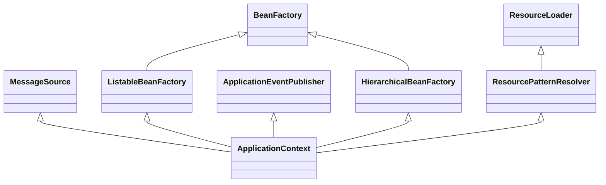
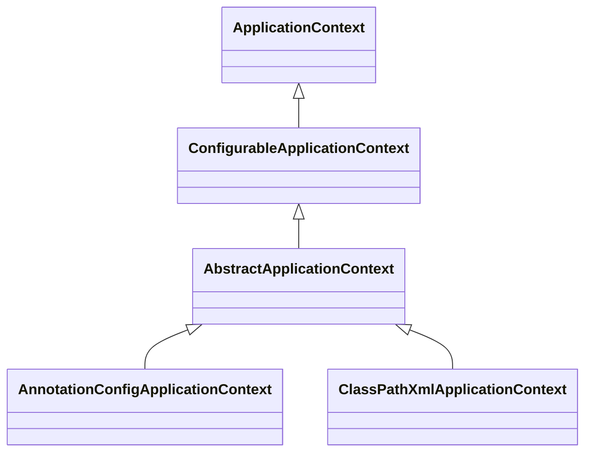
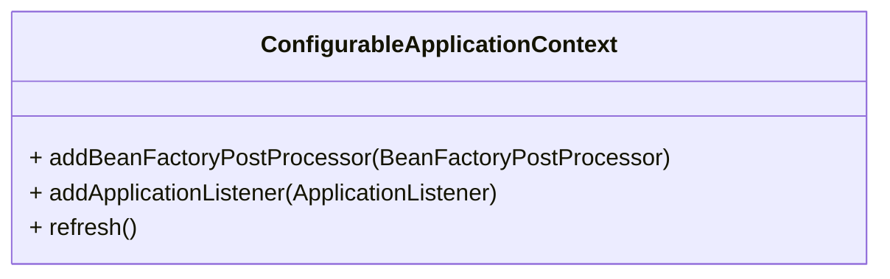

# ApplicationContext

## What

**应用程序（`ApplicationContext`）配置接口，是 Spring Ioc 的核心。**

## Features

`ApplicationContext`的类图如下：

正如类图所示，`ApplicationContext`提供了以下功能：

* 从`ListableBeanFactory`继承用于访问应用程序组件的Bean工厂方法。
* 继承自`ResourceLoader`接口以通用方式加载文件资源的能力。
* 继承自`ApplicationEventPublisher`接口将事件发布给注册的侦听器的能力。
* 继承自`MessageSource`接口解决消息，支持国际化的能力。

## 继承关系

Spring提供了几个`ApplicationContext`常用的子类，如基于`xml`加载的`ClassPathXmlApplicationContext`，基于注解加载的`AnnotationConfigApplicationContext`，其继承关系如下图所示：

其中`ConfigurableApplicationContext`扩展自`ApplicationContext`接口，并提供了可配置的能力，如下图所示：

## How

其中，`refresh()`方法定义了容器加载和刷新时入口，并由`AbstractApplicationContext`提供默认实现，在`refresh()`方法的实现中，按以下方法顺序逐步调用：

```mermaid
flowchart TD
    subgraph two["refresh()"]
    b1["prepareRefresh()"]-->b2["beanFactory = obtainFreshBeanFactory()"]
    b2-->b3["prepareBeanFactory(beanFactory)"]
    b3-->b4["postProcessBeanFactory(beanFactory)"]
    b4-->b5["invokeBeanFactoryPostProcessors(beanFactory)"]
    b5-->b6["registerBeanPostProcessors(beanFactory)"]
    b6-->b7["initMessageSource()"]
    b7-->b8["initApplicationEventMulticaster()"]
    b8-->b9["onRefresh()"]
    b9-->b10["registerListeners()"]
    b10-->b11["finishBeanFactoryInitialization(beanFactory)"]
    b11-->b12["finishRefresh()"]
    b12-->b13["resetCommonCaches()"]
    end
```

除了方法调用清晰之外，基被调用的方法功能也相对简单，以一个表格简单说明：

| 方法                                           | 作用                                          | 备注                |
| ---------------------------------------------- | --------------------------------------------- | ------------------- |
| `prepareRefresh()`                             | 初始化`PropertySources`,准备环境等            |                     |
| `obtainFreshBeanFactory()`                     | 获取`ConfigurableListableBeanFactory`         |                     |
| `prepareBeanFactory(beanFactory)`              | 准备`ConfigurableListableBeanFactory`         |                     |
| `postProcessBeanFactory(beanFactory)`          | 空方法                                        |                     |
| `invokeBeanFactoryPostProcessors(beanFactory)` | 触发后置处理器`BeanFactoryPostProcessor`      | 组件类的扫描、AOP等 |
| `registerBeanPostProcessors(beanFactory)`      | 实例、排序并注册后置处理器`BeanPostProcessor` |                     |
| `initMessageSource()`                          | 初始化`MessageSource`                         |                     |
| `initApplicationEventMulticaster()`            | 初始化`ApplicationEventMulticaster`           |                     |
| `onRefresh()`                                  | 空方法                                        |                     |
| `registerListeners()`                          | 实例并注册`ApplicationListener`               |                     |
| `finishBeanFactoryInitialization(beanFactory)` | 实体化所有非懒加载的单例对象                  |                     |
| `finishRefresh()`                              | 完成刷新，发布事件`ContextRefreshedEvent`     |                     |
| `destroyBeans()`                               | 当发生异常时，销毁已经实例化的对象            |                     |
| `resetCommonCaches()`                          | 清理缓存                                      |                     |
|                                                |                                               |                     |

## 小结

本文以`AnnotationConfigApplicationContext`为例，简述了Spring容器初始化的流程，说明了核心方法`refresh`中各个被调用方法的主要功能。

