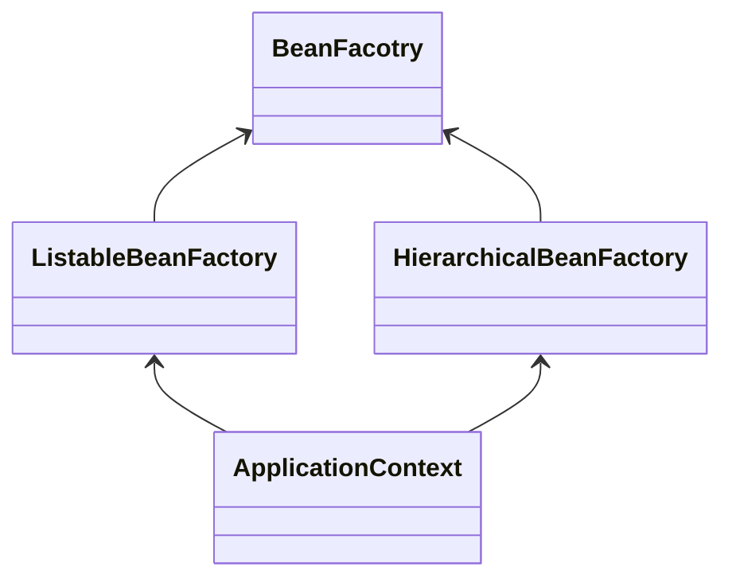

# Spring 三大生命周期


## 简介（What）

与大多数框架一样，Spring也提供了其生命周期回调，以方便开发者Spring的默认行为进行修改或扩展。

Spring将整个生命周期划分为以下三大类：

|    生命周期类型    |      描述       |          回调接口对象          |
| :----------------: | :-------------: | :----------------------------: |
| `SpringApplicaton` | Spring 应用程序 | `SpringApplicationRunListener` |
|   `BeanFactory`    |    Bean工厂     |   `BeanFactoryPostProcessor`   |
|       `Bean`       |    Bean对象     |      `BeanPostProcessor`       |

## SpringApplication

`SpringApplication`是Spring Boot提供的可以从Java `main`方法直接启动Spring容器的类，使用方法如下：

```java
@SpringBootApplication
public class MySpringApplication{
    public static void main(String[] args){
        SpringApplication.run(MySpringApplication.class,args);
    }
}
```

`SpringApplication`将应用的启动过程`run()`拆分为以下几个阶段：


并提供了`SpringApplicationRunListener`回调接口用于监听上述生命周期，`SpringApplicationRunListener`的实现需要声明在`/META-INF/spring.factories`文件中以被SpringApplication加载。

Spring提供了一个内置的实现类`EventPublishingRunListener`，用于发布`ApplicationEvent`事件，各个回调对应的具体事件对象如下：

| 方法                  | Event                                 | 描述         |
| --------------------- | ------------------------------------- | ------------ |
| `starting`            | `ApplicationStartingEvent`            | 应用启动     |
| `environmentPrepared` | `ApplicationEnvironmentPreparedEvent` | 环境准备好   |
| `contextPrepared`     | `ApplicationContextInitializedEvent`  | 容器准备好   |
| `contextLoaded`       | `ApplicationPreparedEvent`            | 容器加载完成 |
| `started`             | `ApplicationStartedEvent`             | 应用启动完成 |
| `running`             | `ApplicationReadyEvent`               | 应用运行中   |
| `failed`              | `ApplicationFailedEvent`              | 应用启动失败 |


## BeanFactoryPostProcessor

`BeanFacotry`是Spring容器的核心接口，`ApplicationContext`也实现了该接口：




| 类                                    | 方法                                                         | 描述 |      |
| ------------------------------------- | ------------------------------------------------------------ | ---- | ---- |
| `BeanDefinitionRegistryPostProcessor` | `postProcessBeanDefinitionRegistry(BeanDefinitionRegistry registry)` |      |      |
| `BeanFactoryPostProcessor`            | `postProcessBeanFactory(ConfigurableListableBeanFactory beanFactory)` |      |      |


## BeanPostProcessor

| 类                                         | 方法                                                         | 描述                         |      |
| ------------------------------------------ | ------------------------------------------------------------ | ---------------------------- | ---- |
| `InstantiationAwareBeanPostProcessor`      | `postProcessBeforeInstantiation(beanClass, beanName)`        | 自定义创建对象，如AOP        |      |
| `InstantiationAwareBeanPostProcessor`      | `postProcessAfterInitialization(result, beanName)`           | 当对象被创建后回调           |      |
| `SmartInstantiationAwareBeanPostProcessor` | `determineCandidateConstructors(beanClass, beanName)`        | 推断构造方法，如`@Autowried` |      |
| `MergedBeanDefinitionPostProcessor`        | `postProcessMergedBeanDefinition(mbd, beanType, beanName)`   |                              |      |
| `SmartInstantiationAwareBeanPostProcessor` | `getEarlyBeanReference(exposedObject, beanName)`             |                              |      |
| `InstantiationAwareBeanPostProcessor`      | `postProcessAfterInstantiation(bw.getWrappedInstance(), beanName)` |                              |      |
| `InstantiationAwareBeanPostProcessor`      | `postProcessProperties(pvs, bw.getWrappedInstance(), beanName)` |                              |      |
| `InstantiationAwareBeanPostProcessor`      | `postProcessPropertyValues(pvs, filteredPds, bw.getWrappedInstance(), beanName)` |                              |      |
| `BeanPostProcessor`                        | `postProcessBeforeInitialization(result, beanName)`          |                              |      |
| `BeanPostProcessor`                        | `postProcessAfterInitialization(result, beanName)`           |                              |      |
| `DestructionAwareBeanPostProcessor`        | `requiresDestruction(bean)`                                  |                              |      |
|                                            |                                                              |                              |      |

