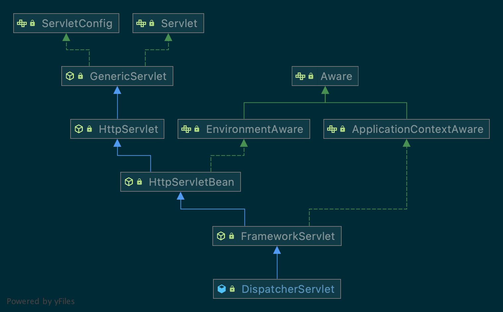

# Spring MVC 源码分析 之 DispatcherServlet


## What

`DispatcherServlet`是Spring MVC中用来分派用户请求的`Servlet`。



## Strategy

DispatcherServlet是由一系列实现特定功能的策略对象组成的，这些策略对象相互组合，共同了SpringMVC的核心功能。Spring对这些策略对象进行管理，并提供了了一套默认的配置，同样也提供了灵活的扩展与功能改写。

| Bean类名                                     | Bean名称                   | 功能                                                         |
| -------------------------------------------- | -------------------------- | ------------------------------------------------------------ |
| `MultipartResolver`                          | `multipartResolver`        | 在相应的解析策略支持下，对`multi-part`请求（比如浏览器的表单文件上传）进行解析。 |
| `LocaleResolver`<br/>`LocaleContextResolver` | `localeResolver`           | 解析客户端当前请求的区域信息，从而能够返回该地区的国际化视图。 |
| `ThemeResolver`                              | `themeResolver`            | 解析当前应用的主题，从而提供个性化布局                       |
| `HandlerMapping`                             | `handlerMapping`           | 将请求映射到处理程序以及用于预处理和后续处理的一系列拦截器。 这种映射有着一套标准，具体的功能因 HandlerMapping 实现而异。            HandlerMapping 的两个最主要实现是 RequestMappingHandlerMapping 和 SimpleUrlHandlerMapping ,前者支持 @RequestMapping 注释方法，它为请求的处理进行 URI 映射的注册。 |
| `HandlerAdapter`                             | `handlerAdapter`           | 协助 DispatcherServlet 调用匹配请求映射的处理程序，且不需要关心如何调用处理程序以及处理程序的任何细节。 例如，调用带注释的控制器中的方法需要先对 @RequestMapping 等注释进行解析。 HandlerAdapter 的主要功能是屏蔽 DispatcherServlet 的实现细节。 |
| `HandlerExceptionResolver`                   | `handlerExceptionResolver` | 异常处理策略，可以处理HandlerMethod中抛出的异常，但不能处理视图渲染过程中的异常。 |
| `RequestToViewNameTranslator`                | `viewNameTranslator`       |                                                              |
| `ViewResolver`                               | `viewResolver`             | 将处理程序返回的逻辑视图名称（String）解析为真实视图并返回给客户。 |
| `FlashMapManager`                            | `flashMapManager`          | 存储和检索可将参数从一个请求传递到另一个请求的“输入”和“输出”的 FlashMap，通常通过重定向来实现。 |


## Init

`DispatcherServlet`本质是一个`Servlet`，因此，其初始化的入口为`init()`方法：

### HttpServletBean.init()

```java
	@Override
	public final void init() throws ServletException {

		// Set bean properties from init parameters.
		PropertyValues pvs = new ServletConfigPropertyValues(getServletConfig(), this.requiredProperties);
		if (!pvs.isEmpty()) {
			try {
				BeanWrapper bw = PropertyAccessorFactory.forBeanPropertyAccess(this);
				ResourceLoader resourceLoader = new ServletContextResourceLoader(getServletContext());
				bw.registerCustomEditor(Resource.class, new ResourceEditor(resourceLoader, getEnvironment()));
				initBeanWrapper(bw);
				bw.setPropertyValues(pvs, true);
			}
			catch (BeansException ex) {
				if (logger.isErrorEnabled()) {
					logger.error("Failed to set bean properties on servlet '" + getServletName() + "'", ex);
				}
				throw ex;
			}
		}

		// Let subclasses do whatever initialization they like.
		initServletBean();
	}
```

### FrameworkServlet.initServletBean()

```java
	@Override
	protected final void initServletBean() throws ServletException {
		getServletContext().log("Initializing Spring " + getClass().getSimpleName() + " '" + getServletName() + "'");
		if (logger.isInfoEnabled()) {
			logger.info("Initializing Servlet '" + getServletName() + "'");
		}
		long startTime = System.currentTimeMillis();

		try {
			this.webApplicationContext = initWebApplicationContext();
			initFrameworkServlet();
		}
		catch (ServletException | RuntimeException ex) {
			logger.error("Context initialization failed", ex);
			throw ex;
		}

		if (logger.isDebugEnabled()) {
			String value = this.enableLoggingRequestDetails ?
					"shown which may lead to unsafe logging of potentially sensitive data" :
					"masked to prevent unsafe logging of potentially sensitive data";
			logger.debug("enableLoggingRequestDetails='" + this.enableLoggingRequestDetails +
					"': request parameters and headers will be " + value);
		}

		if (logger.isInfoEnabled()) {
			logger.info("Completed initialization in " + (System.currentTimeMillis() - startTime) + " ms");
		}
	}
```


## How

### Dispatch

```java
protected void doDispatch(HttpServletRequest request, HttpServletResponse response) throws Exception {
    HttpServletRequest processedRequest = request;
    HandlerExecutionChain mappedHandler = null;
    boolean multipartRequestParsed = false;

    WebAsyncManager asyncManager = WebAsyncUtils.getAsyncManager(request);

    try {
        ModelAndView mv = null;
        Exception dispatchException = null;

        try {
            /**
             * 1、调用 {@link MultipartResolver#isMultipart(HttpServletRequest)}方法检测请求是否是文件上传，
             * 如果是，则调用 {@link MultipartResolver#resolveMultipart(HttpServletRequest)} 对请求进行解析
             */
            processedRequest = checkMultipart(request);
            multipartRequestParsed = (processedRequest != request);

            // Determine handler for the current request.
            /**
             * 2、逐个调用 {@link HandlerMapping#getHandler(HttpServletRequest)}方法，以获取 {@link HandlerExecutionChain}对象实例
             */
            mappedHandler = getHandler(processedRequest);
            if (mappedHandler == null) {
                noHandlerFound(processedRequest, response);
                return;
            }

            // Determine handler adapter for the current request.
            /**
             * 3、逐个调用 {@link HandlerAdapter#supports(Object)}}方法，找到第一个支持处理 Handler 的 {@link HandlerAdapter}
             */
            HandlerAdapter ha = getHandlerAdapter(mappedHandler.getHandler());

            // Process last-modified header, if supported by the handler.
            String method = request.getMethod();
            boolean isGet = "GET".equals(method);
            /**
             * 4、处理 GET｜HEAD 请求中的 last-modified 请求头
             */
            if (isGet || "HEAD".equals(method)) {
                long lastModified = ha.getLastModified(request, mappedHandler.getHandler());
                if (new ServletWebRequest(request, response).checkNotModified(lastModified) && isGet) {
                    return;
                }
            }

            /**
             * 5、触发拦截器 {@link HandlerInterceptor#preHandle(HttpServletRequest, HttpServletResponse, Object) }方法
             */
            if (!mappedHandler.applyPreHandle(processedRequest, response)) {
                return;
            }

            // Actually invoke the handler.
            /**
             * 6、调用 {@link HandlerAdapter#handle(HttpServletRequest, HttpServletResponse, Object)}方法真实处理 {@code handler}
             */
            mv = ha.handle(processedRequest, response, mappedHandler.getHandler());

            if (asyncManager.isConcurrentHandlingStarted()) {
                return;
            }
            /**
             * 7、从 Request 翻译视图名称 {@link RequestToViewNameTranslator#getViewName(HttpServletRequest)}
             */
            applyDefaultViewName(processedRequest, mv);
            /**
             * 8、触发拦截器的 {@link HandlerInterceptor#postHandle(HttpServletRequest, HttpServletResponse, Object, ModelAndView)} 方法
             */
            mappedHandler.applyPostHandle(processedRequest, response, mv);
        } catch (Exception ex) {
            dispatchException = ex;
        } catch (Throwable err) {
            // As of 4.3, we're processing Errors thrown from handler methods as well,
            // making them available for @ExceptionHandler methods and other scenarios.
            dispatchException = new NestedServletException("Handler dispatch failed", err);
        }
        /**
         * 9、处理 DispatchResult
         */
        processDispatchResult(processedRequest, response, mappedHandler, mv, dispatchException);
    } catch (Exception ex) {
        /**
         * 10、触发 {@link HandlerInterceptor#afterCompletion(HttpServletRequest, HttpServletResponse, Object, Exception)}方法
         */
        triggerAfterCompletion(processedRequest, response, mappedHandler, ex);
    } catch (Throwable err) {
        triggerAfterCompletion(processedRequest, response, mappedHandler,
                new NestedServletException("Handler processing failed", err));
    } finally {
        if (asyncManager.isConcurrentHandlingStarted()) {
            // Instead of postHandle and afterCompletion
            if (mappedHandler != null) {
                /**
                 * 11、触发 {@link AsyncHandlerInterceptor#afterConcurrentHandlingStarted(HttpServletRequest, HttpServletResponse, Object)}方法
                 */
                mappedHandler.applyAfterConcurrentHandlingStarted(processedRequest, response);
            }
        } else {
            // Clean up any resources used by a multipart request.
            /**
             * 12、如果是文件上传请求，则清理 {@link MultipartResolver#cleanupMultipart(MultipartHttpServletRequest)}
             */
            if (multipartRequestParsed) {
                cleanupMultipart(processedRequest);
            }
        }
    }
}
```

1. 通过`checkMultipart()`方法中调用`MultipartResolver`的`isMultipart()`方法检测当前请求`HttpServletRequest`是否是文件上传，如果是，则用`resolveMultipart()`来解析当前请求。
2. 通过`getHandler()`方法逐个调个`HandlerMapping`的`getHandler()`方法，以获取`HandlerExecutionChain`实例，如果未获取到，则抛出异常`NoHandlerFoundException`或直接返回`404`。
3. 逐个调用`HandlerAdapter`的`supports()`方法，以找到能够处理当前`Handler` 的`HandlerAdapter`实例；
4. 处理`Get`或`HEAD`请求中的`last-modified`请求头；
5. 通过`HandlerExecutionChain`触发拦截器`HandlerInterceptor`的`preHandle()`方法；
6. 通过`HandlerAdapter`的`handle()`方法真实处理`handler`；
7. 调用`RequestToViewNameTranslator`的`getViewName()`方法，从请求中获取视图名；
8. 通过`HandlerExecutionChain`的`applyPostHandle()`方法触发拦截器`HandlerInterceptor`的`postHandle()`方法；
9. 处理结果
10. 通过`HandlerExecutionChain`的`triggerAfterCompletion()`方法触发拦截器的`afterCompletion()`方法；
11. 通过`HandlerExecutionChain`的`applyAfterConcurrentHandlingStarted()`方法触发拦截器的`afterConcurrentHandlingStarted()`方法；
12. 如果当前请求是文件上传，则调用`MultipartResolver`的`cleanupMultipart()`方法清理现场。


## See

* [Spring MVC 解析之 DispatcherServlet](https://juejin.cn/post/6844903577077415950)

