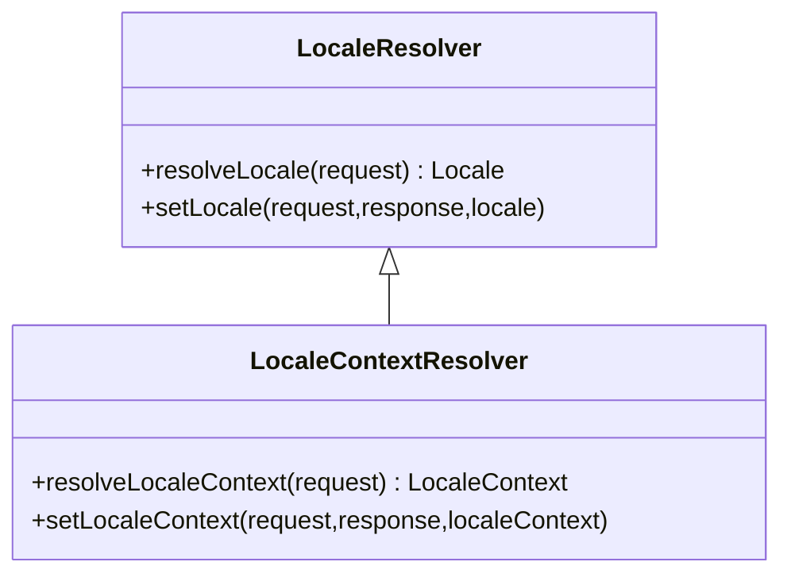

# LocaleResolver

## 简介（What）

`LocaleResolver`是SpringMVC定义的基于Web的语言环境策略接口，用于解析当前请求所接收的语言环境，为项目的国际化提供支持。

## Definition

Spring 提供了`LocaleResolver`及其扩展`LocaleContextResolver`两个接口用于MVC的语言环境解析，两者关系如下图所示：




### LocaleResolver

`LocaleResolver`的定义如下：

```java
package org.springframework.web.servlet;

public interface LocaleResolver {
    
    Locale resolveLocale(HttpServletRequest request);

    
    void setLocale(HttpServletRequest request, @Nullable HttpServletResponse response, @Nullable Locale locale);

}
```

其中，`resolveLocale(HttpServletRequest)`用于从请求中解析`Locale`，`setLocale(HttpServletRequest,HttpServletResponse,Locale)`用于将`Locale`修改为指定的值。

### LocaleContextResolver

`LocaleContextResolver`在`LocaleResolver`的基础之上，使用`LocalContext`替代`Locale`，以实现对更多语言环境变量的支持，如时区`TimeZone`，其定义如下：

```java
package org.springframework.web.servlet;

public interface LocaleContextResolver extends LocaleResolver {

	LocaleContext resolveLocaleContext(HttpServletRequest request);

	void setLocaleContext(HttpServletRequest request, @Nullable HttpServletResponse response,
			@Nullable LocaleContext localeContext);

}
```

### LocaleContextHolder

`LocaleContextHolder`是一个基于`ThreadLocal`的工具类，用于存储由`LocaleResolver`从请求中解析到的`Locale`变量及由`LocaleContextResolver`解析到的`LocalContext`变量，其核心方法如下:

* `getLocale():Locale`：获取`Locale`对象；
* `getTimeZone():TimeZone`：获取`TimeZone`对象；

## Init

在`DispatchServlet`的`initLocaleResolver()`方法中，有这样一段代码：

```java
//     public static final String LOCALE_RESOLVER_BEAN_NAME = "localeResolver";
this.localeResolver=context.getBean(LOCALE_RESOLVER_BEAN_NAME,LocaleResolver.class);
```

而`LOCALE_RESOLVER_BEAN_NAME`的值为`localeResolver`，想必此刻，小伙伴们应该都明白了自在定义`LocaleResolver`时，
`bean`的名称为什么必须声明为`localeResolver`了吧，这就是根本原因所在。

## How

### CookieLocaleResolver